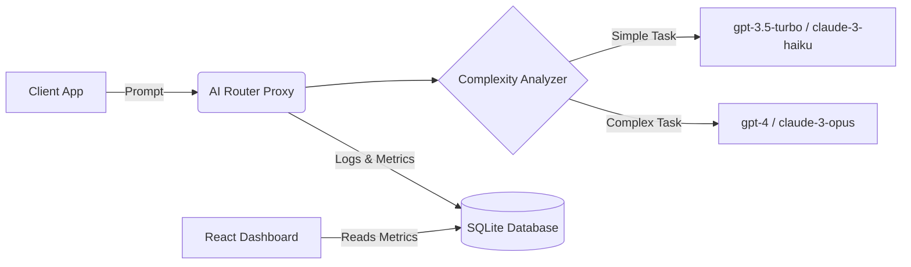

<div align="center">

# 🌿 Frugal AI Router

**An intelligent proxy layer that routes AI requests to the most resource-efficient model based on task complexity, cost, and sustainability metrics.**

[](https://opensource.org/licenses/MIT)
[](https://nodejs.org/)
[](https://reactjs.org/)
[](https://www.docker.com/)

[Features](#-features) •
[Architecture](#%EF%B8%8F-architecture) •
[Getting Started](#-getting-started) •
[Usage](#-testing-the-router) •
[Contributing](#-contributing)

</div>

---

## 🎯 The Vision

The **Frugal AI Router** aims to reduce AI API costs and carbon footprint without sacrificing performance. It acts as a smart proxy layer between your application and various LLM providers. By analyzing the complexity of incoming prompts, it intelligently selects the right model for the job—using cheaper, smaller models for simple tasks and reserving large, expensive models for complex reasoning.

## ✨ Features

- 🧠 **Smart Routing**: Intelligently routes requests based on task complexity (Simple vs. Complex).
- 💰 **Cost Tracking**: Estimates API costs for each request and calculates savings.
- 🌱 **Energy Tracking**: Estimates carbon footprint (CO2) and energy usage for a greener AI footprint.
- ⚙️ **Configurable Strategies**:
  - `cost-first`: Prioritizes the most cost-effective model.
  - `green-first`: Prioritizes the most energy-efficient model.
  - `performance-first`: Prioritizes capability and accuracy.
- 📊 **Real-time Dashboard**: Visualize your savings and routing decisions with a sleek React frontend.

## 🏗️ Architecture

The project consists of a Node.js/Express backend and a React/Vite frontend.



1. **Backend (Node.js/Express)**:
   - Analyzes prompt complexity using heuristics or a small orchestrator model.
   - Routes to various providers (`gpt-4`, `gpt-3.5-turbo`, `claude-3-opus`, `claude-3-haiku`).
   - Logs metrics, costs, and carbon estimations to a local SQLite database.
2. **Frontend (React/Vite)**:
   - A beautiful dashboard displaying real-time statistics (Cost & CO2 saved).
   - Configuration panel for adjusting routing strategies on the fly.
   - Built-in chat playground for testing prompts.

## 🚀 Getting Started

### Prerequisites

- [Node.js](https://nodejs.org/) (v18 or higher)
- (Optional) [Docker](https://www.docker.com/) and Docker Compose

### 🐳 Option 1: Run with Docker (Recommended)

The easiest way to get started is using Docker Compose:

```bash
# Clone the repository
git clone https://github.com/sharma23Mukul/ai-router.git
cd frugal-ai-router

# Build and run the containers
docker-compose up --build
```

Access the dashboard at `http://localhost:5173`.

### 💻 Option 2: Run Locally

1. **Clone the repository**:
   ```bash
   git clone https://github.com/sharma23Mukul/ai-router.git
   cd frugal-ai-router
   ```

2. **Backend Setup**:
   ```bash
   cd backend
   npm install
   # Create a .env file if you want to use custom API keys
   # (Defaults/mock responses are provided in the code for demo purposes)
   npm start
   ```
   *The backend server will run on `http://localhost:3000`.*

3. **Frontend Setup**:
   Open a new terminal window:
   ```bash
   cd frontend
   npm install
   npm run dev
   ```
   *Open `http://localhost:5173` in your browser.*

## 🧪 Testing the Router

1. Open the **Dashboard** in your browser.
2. Select a routing strategy (e.g., "Cost First" or "Green First").
3. Enter a prompt in the **Playground**:
   - **Try a simple prompt**: *"Translate 'hello' to French."* 👉 Should route to a smaller, cheaper model.
   - **Try a complex prompt**: *"Write a Python script to implement a distributed consensus algorithm."* 👉 Should route to a more capable model.
4. Watch the **"Est. Cost Saved"** and **"Est. Energy Saved"** metrics update in real-time!

## 🤝 Contributing

We welcome contributions! If you have ideas for better complexity analysis, more provider integrations, or UI improvements, please open an issue or submit a pull request.

1. Fork the Project
2. Create your Feature Branch (`git checkout -b feature/AmazingFeature`)
3. Commit your Changes (`git commit -m 'Add some AmazingFeature'`)
4. Push to the Branch (`git push origin feature/AmazingFeature`)
5. Open a Pull Request

## 📜 License

Distributed under the MIT License. See `LICENSE` for more information.

---
<div align="center">
Made with ❤️ for a sustainable AI future.
</div>

<!-- Verified for Release v1.0 [Jan 30 2026] -->
<!-- Verified for Release v1.0 [Jan 30 2026] -->
<!-- Verified for Release v1.0 [Jan 30 2026] -->

# Updated Roadmap Progress
